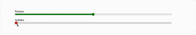

# Zeno's Paradox of Achilles and the Tortoise – Metrobit

A simple React project showcasing the Zeno's Paradox of Achilles and the Tortoise with Sliders.
Built for Metrobit using **Vite**. No additional libraries were used.

---
## Solution




---

## 🚀 Getting Started

### 1. Clone the repository
```bash
git clone https://github.com/MatheusCandido1/metrobit-front-end-challenge-6.git
cd metrobit-front-end-challenge-6
```


### 2. Install dependencies
```bash
npm install
or
yarn
```

### 3. Start the development server
```bash
npm run dev
or
yarn dev

This will start the Vite dev server. Open your browser and go to:

http://localhost:5173/
```
